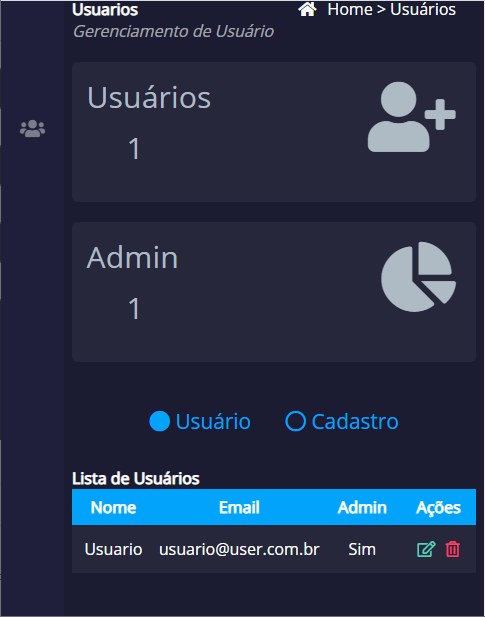

# Gerencialmento de Usuário

Templete baseado no AdminLTE para fazer gerenciamento de usuário

<h3>Recursos</h3>
  <ul>
    <li>Responsivo/Menu Hamburguer</li>
    <li>Cadastro/Edição de Registro já cadastrados</li>
    <li>Exclusão de Registros(work)</li>
    <li>Permite adicionar uma foto de perfil</li>
  </ul>
  
  <h3>Screenshot</h3>
    <h4 align="center">
      
    </h4>
    <h4 align="center">
      
    </h4>
    <h4 align="center">
      
    </h4>
